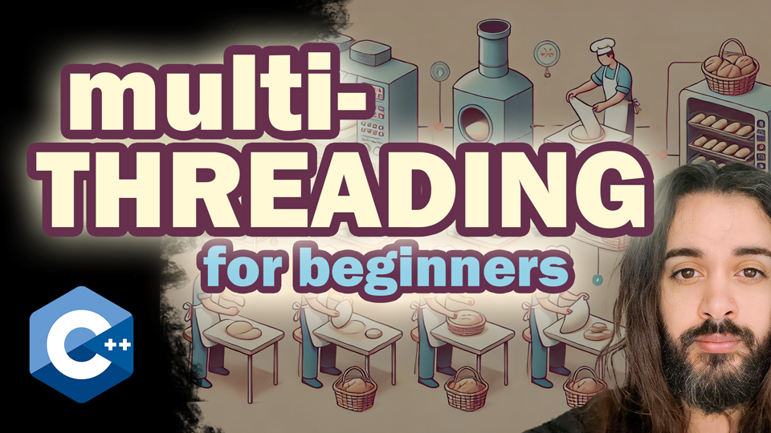

# Thread Bakers - Single File Version

<div style="text-align: center;">
    
</div>

## 📌 About This Project
This is a **multithreading tutorial** for beginners demonstrating **thread synchronization, mutex locks, and performance tracking** in C++.  
It simulates **8 bakers (threads) working together** to bake **20 pies** as fast as possible.

This project is part of a **YouTube tutorial** explaining C++ multithreading concepts.

---

## 📂 Project Structure

| File | Description |
|------|------------|
| `main.cpp` | The complete multithreaded baking simulation |
| `compile.bat` | Windows batch script to compile the program |
| `run.bat` | Windows batch script to run the compiled program |
| `compile.sh` | Linux/macOS shell script to compile the program |
| `run.sh` | Linux/macOS shell script to run the program |

This version of the tutorial covers **all multithreading concepts in a single file (`main.cpp`)**.

---

## 🛠️ Requirements

To run this project, ensure you have:

- **g++ (GNU Compiler Collection) with C++17 support**
- A **Windows or Linux/macOS system**
- A **terminal or command prompt** to compile and execute the code

Check if `g++` is installed by running:

```sh
g++ --version
```

If not installed, you can install it using:

### 🔹 **Windows (via MinGW)**
1. Download MinGW from [MinGW-w64](https://www.mingw-w64.org/downloads/).
2. Install it and add `g++` to the system path.
3. Verify installation by running `g++ --version`.

### 🔹 **Linux/macOS**
```sh
sudo apt install g++   # Debian/Ubuntu
sudo yum install gcc-c++  # Fedora/CentOS
brew install gcc  # macOS (using Homebrew)
```

---

## 🚀 How to Use

### **Compiling the Code**
You can compile `main.cpp` manually using:

```sh
g++ -o bakery main.cpp -std=c++17 -lpthread
```

### **Running the Program**
After compiling, run:

```sh
./bakery   # Linux/macOS
out\bakery.exe   # Windows (if using the batch script)
```

---

## 📜 **Automated Compilation & Execution**

### **Windows (`compile.bat` & `run.bat`)**
On **Windows**, you can use the `compile.bat` script to compile:

```sh
./compile.bat
```

To run the compiled program:

```sh
./run.bat
```

### **Linux/macOS (`compile.sh` & `run.sh`)**
For **Linux/macOS**, equivalent shell scripts are provided:

**`compile.sh`**
```sh
chmod +x compile.sh
./compile.sh
```

**`run.sh`**
```sh
chmod +x run.sh
./run.sh
```

---

## 📺 YouTube Tutorial
This project is part of a [**YouTube tutorial**](https://youtu.be/YO5sBoywsRY) that explains the code in detail. Watch the video to follow along.

---

## 📜 License
This project is licensed under the **MIT License**.

Happy coding! 🚀
