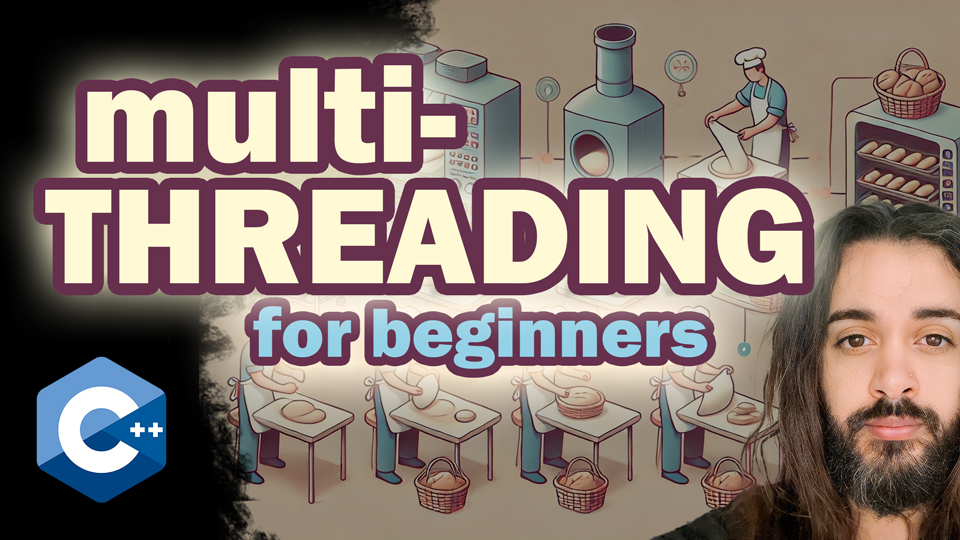

# Thread Bakers - Multithreading Tutorial

<div style="text-align: center;">
    
</div>

## 📌 About This Project
This is a **multithreading tutorial** for beginners that demonstrates how to move from **sequential execution** to **parallel execution** using **C++ threads, mutexes, and lock guards**. The project progresses through **five steps**, each showing a new concept.

This project is part of a **YouTube tutorial** explaining C++ multithreading concepts.

---

## 📂 Project Structure

| Step | Description |
|------|------------|
| `step_1.cpp` | Sequential processing (one baker at a time) |
| `step_2.cpp` | Parallel processing with race conditions |
| `step_3.cpp` | Fixing race conditions using `std::mutex` |
| `step_4.cpp` | Using `std::lock_guard` for safer locking |
| `step_5.cpp` | Optimizing multithreading with more bakers |

Each step builds upon the previous one to introduce **key multithreading concepts**.

---

## 🛠️ Requirements

To run this project, ensure you have:

- **g++ (GNU Compiler Collection) with C++17 support**
- A **Windows or Linux/macOS system**
- A **terminal or command prompt** to compile and execute the code

Check if `g++` is installed by running:

```sh
g++ --version
```

If not installed, you can install it using:

### 🔹 **Windows (via MinGW)**
1. Download MinGW from [MinGW-w64](https://www.mingw-w64.org/downloads/).
2. Install it and add `g++` to the system path.
3. Verify installation by running `g++ --version`.

### 🔹 **Linux/macOS**
```sh
sudo apt install g++   # Debian/Ubuntu
sudo yum install gcc-c++  # Fedora/CentOS
brew install gcc  # macOS (using Homebrew)
```

---

## 🚀 How to Use

### **Compiling the Code**
You can compile any step using:

```sh
g++ -o bakery step_X.cpp -std=c++17
```

Replace `X` with the step number (e.g., `step_1.cpp`).

### **Running the Program**
After compiling, run:

```sh
./bakery   # Linux/macOS
out\bakery.exe   # Windows (if using the batch script)
```

---

## 📜 **Automated Compilation & Execution**

### **Windows (`test.bat`)**
On **Windows**, you can use the `test.bat` script to compile and execute:

```sh
./steps/test.bat
```

### **Linux/macOS (`test.sh`)**
For **Linux/macOS**, a shell version of `test.bat` is provided:

```sh
chmod +x ./steps/test.sh
./steps/test.sh
```

---

## 📺 YouTube Tutorial
This project is part of a [**YouTube tutorial**](https://youtu.be/YO5sBoywsRY) that explains each step in detail. Watch the video to follow along.

---

## 📜 License
This project is licensed under the **MIT License**.

Happy coding! 🚀
